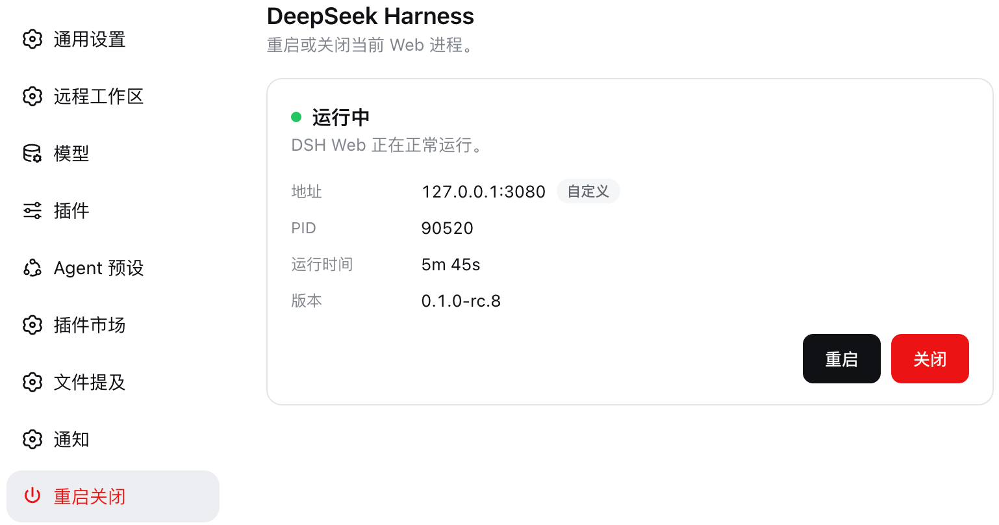

# dsh-web-lifecycle

在 DeepSeek Harness Web 里重启或关闭当前进程。不用回终端，也不用 `kill`。

打开 **设置 → 重启关闭**：

<p align="center">
  
</p>

页面只做三件事：看状态、重启、关闭。

- 地址来自当前真正在听的端口，不是写死的 `3080`
- 运行时间打开后每秒更新
- 版本是正在跑的 DSH，例如 `0.1.0-rc.8`
- **重启** 黑底白字，**关闭** 红底白字，点下去会先确认

重启后浏览器会等同一个地址恢复，然后自动刷新。关闭之后不会偷偷再拉起来。

## 安装

```bash
dsh plugin --profile web add github:Zhong0118/dsh-web-lifecycle
```

装完后重启一次 DSH Web（关掉当前 `dsh web` 再开，或用本插件的「重启」）。刷新页面，打开设置左侧的 **重启关闭**。

指定分支：

```bash
dsh plugin --profile web add github:Zhong0118/dsh-web-lifecycle#main
```

本地开发：

```bash
npm install
npm run build
dsh plugin --profile web add link:/absolute/path/to/dsh-web-lifecycle
```

## 更新

```bash
dsh plugin --profile web update
```

然后重启 DSH Web。

## 重启时端口怎么处理

| 你怎么启动 | 重启后 |
| --- | --- |
| `dsh web` | 还是原来的端口 |
| `dsh web --port 8080` | 还是 `8080` |
| `dsh web --port 0` | 还是这次实际分到的端口，浏览器不用换地址 |

关闭走 `ctx.appExit`，优雅退出。不会按端口去杀别的进程。

## License

MIT
